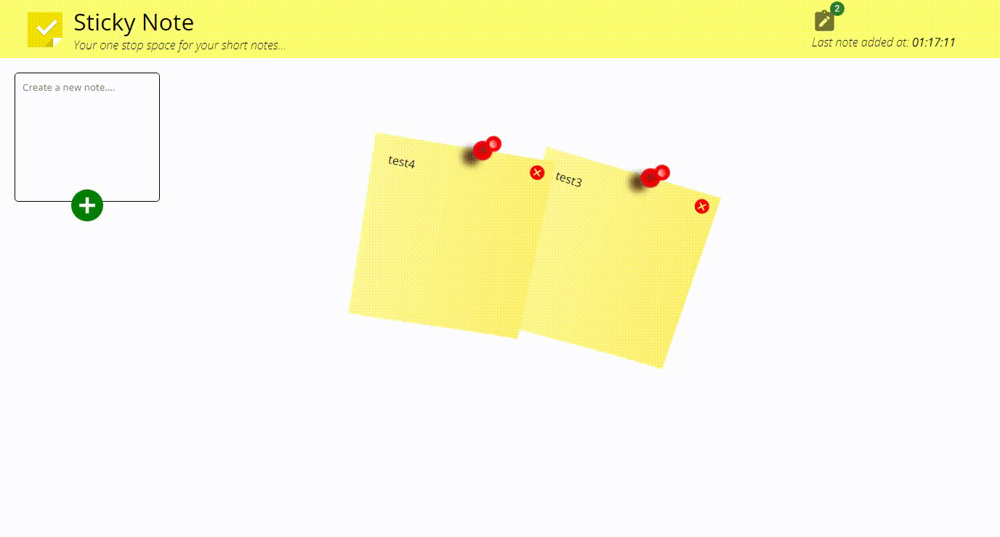

# Sticky-Note Web App

**_Your one stop space for your sticky notes....._**

<hr />

## Table of contents

- [Overview](#overview)
  - [Description](#desc)
  - [User-Stories](#user__story)
  - [Preview](#preview)
  - [Links](#links)
- [My process](#my-process)
  - [Built with](#built-with)
  - [Continued development](#continued-development)
- [Author](#author)

## Overview

### Description

This is a webapp which enable users to take short notes and pin it on their view screen, it has mostly all the functionality a traditional sticky note used for note taking has, for instance it can be dragged and dropped anywhere across the user's viewport.

### User Stories

The following user stories was fulfilled;

**Users should be able to:**

- See the size of the notes being adjusted based on their device's screen size
- Drag and drop the notes across the viewport
- To retain their data after page reload/refresh
- To see the time the last note was created
- To see the note count in real time

### Preview



### Links

- Live Site URL: [Live view](https://sticky-note-ab09d.web.app/)

## My process

### Built with/Approach/Tech Used

- HTML5
- Vanilla CSS3
- React
- Redux/Redux-toolkit
- Firebase/Cloud Firestore (for real-time database)
- Firebase Hosting (for deployment)
- Desktop-first workflow

### Continued development

I might consider adding user authentication and a long term storage for deleted notes so as to eneable it to be restored after deletion

```js
export const JustAnotherProject = () => {
  return <>🎉</>;
};
```

## Author

- LinkedIn - [Let's connect 🔗](http://www.linkedin.com/in/yaya-usman-adaiza-430964192)
- Twitter - [Let's be tweep mutuals 🥰](https://twitter.com/y_usman007)
- Website - [check back in few months time 🤤]()
